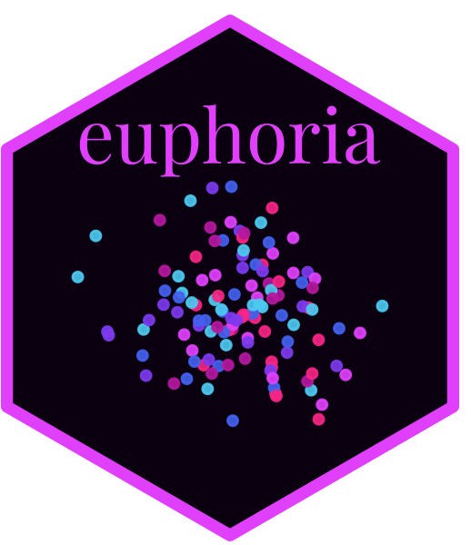
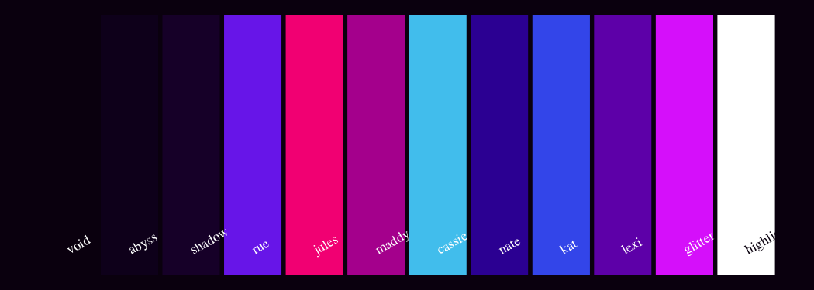
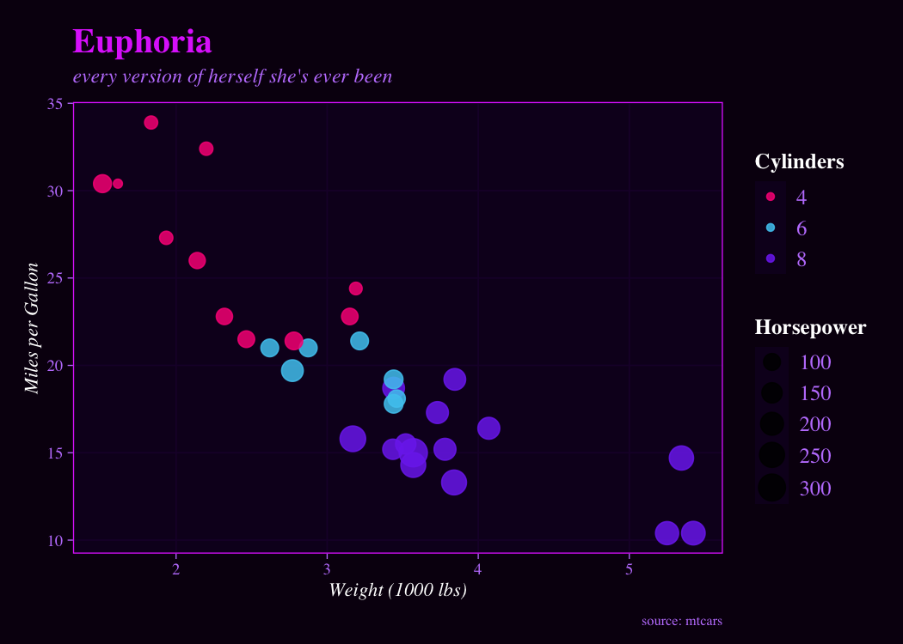
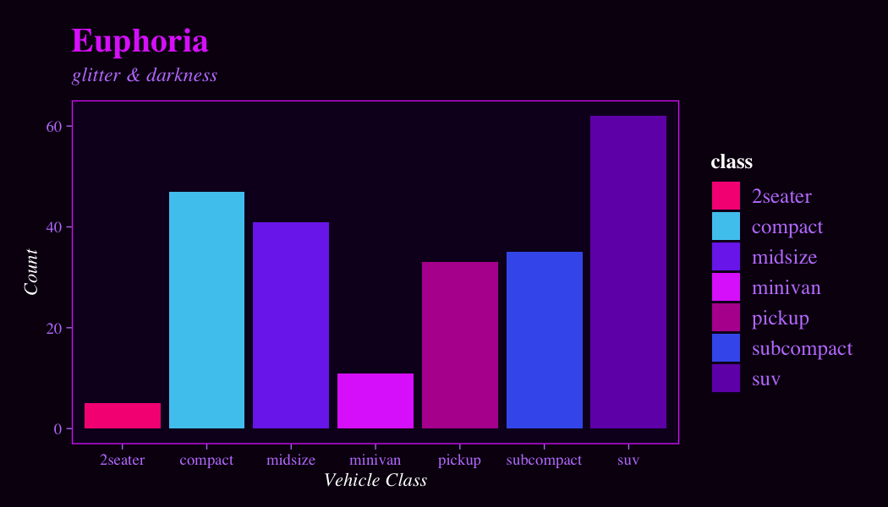
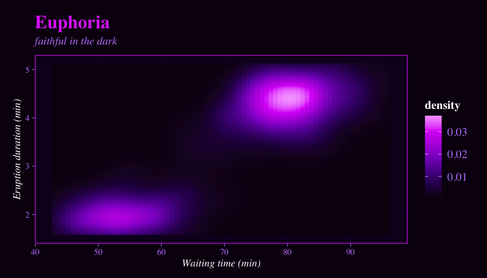
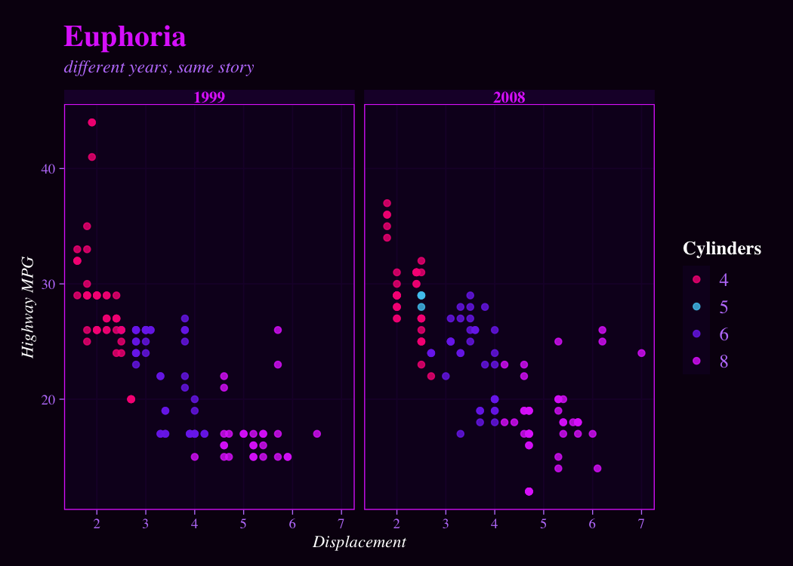

<!-- README.md is generated from README.Rmd. Please edit that file -->

# euphoria 

> *“Is this f**** plot about us?”*

**{euphoria}** is a ggplot2 theme and color palette package inspired by
the visual aesthetic of HBO’s Euphoria — deep purple-black backgrounds,
neon orchid glows, electric pinks and icy blues.

## Installation

``` r
# Install from GitHub
# install.packages("remotes")
remotes::install_github("samracuna/euphoria")
```

## The Palette

The palette is built around 10 named colors, each tied to a character:



## Usage

### Scatter plot

``` r
library(ggplot2)
library(euphoria)

ggplot(mtcars, aes(wt, mpg, colour = factor(cyl), size = hp)) +
  geom_point(alpha = 0.85) +
  scale_colour_euphoria() +
  scale_size_continuous(range = c(2, 7)) +
  labs(
    title    = "Euphoria",
    subtitle = "every version of herself she's ever been",
    x        = "Weight (1000 lbs)",
    y        = "Miles per Gallon",
    colour   = "Cylinders",
    size     = "Horsepower",
    caption  = "source: mtcars"
  ) +
  theme_euphoria()
```



### Bar chart

``` r
ggplot(mpg, aes(class, fill = class)) +
  geom_bar() +
  scale_fill_euphoria() +
  labs(title = "Euphoria", subtitle = "glitter & darkness",
       x = "Vehicle Class", y = "Count") +
  theme_euphoria(grid = FALSE)
```



### Heatmap (continuous fill)

``` r
ggplot(faithfuld, aes(waiting, eruptions, fill = density)) +
  geom_tile() +
  scale_fill_euphoria_c() +
  labs(title = "Euphoria", subtitle = "faithful in the dark",
       x = "Waiting time (min)", y = "Eruption duration (min)") +
  theme_euphoria()
```



### Faceted plot

``` r
ggplot(mpg, aes(displ, hwy, colour = factor(cyl))) +
  geom_point(alpha = 0.8) +
  facet_wrap(~year) +
  scale_colour_euphoria() +
  labs(title = "Euphoria", subtitle = "different years, same story",
       x = "Displacement", y = "Highway MPG", colour = "Cylinders") +
  theme_euphoria()
```



## Font tip 🎨

For maximum Euphoria vibes, use a Google Font like **Playfair Display**:

``` r
library(showtext)
font_add_google("Playfair Display", "playfair")
showtext_auto()

ggplot(mtcars, aes(wt, mpg, colour = factor(cyl))) +
  geom_point(size = 3) +
  scale_colour_euphoria() +
  labs(title = "Euphoria") +
  theme_euphoria(base_family = "playfair")
```

## Color reference

| Name        | Hex       | Character   |
|-------------|-----------|-------------|
| `void`      | `#0a0010` | background  |
| `abyss`     | `#110022` | panel       |
| `shadow`    | `#1e0035` | grid        |
| `rue`       | `#7c3aed` | Rue         |
| `jules`     | `#f72585` | Jules       |
| `maddy`     | `#b5179e` | Maddy       |
| `cassie`    | `#4cc9f0` | Cassie      |
| `nate`      | `#3a0ca3` | Nate        |
| `kat`       | `#4361ee` | Kat         |
| `lexi`      | `#7209b7` | Lexi        |
| `glitter`   | `#e040fb` | accent/glow |
| `highlight` | `#ffffff` | text        |

## License

MIT © Your Name
